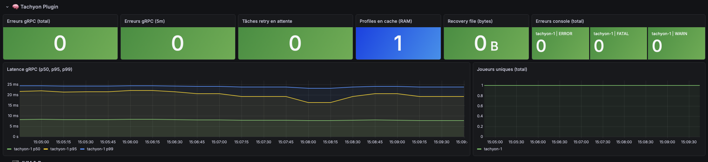
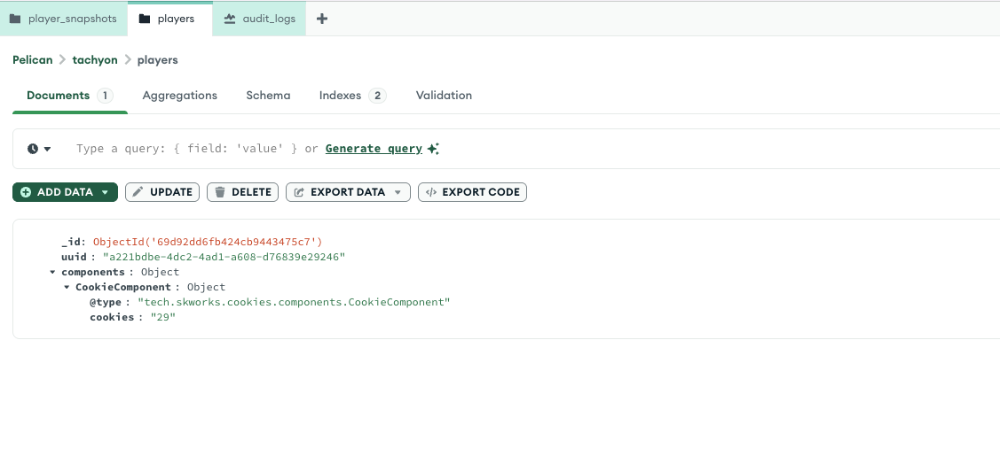
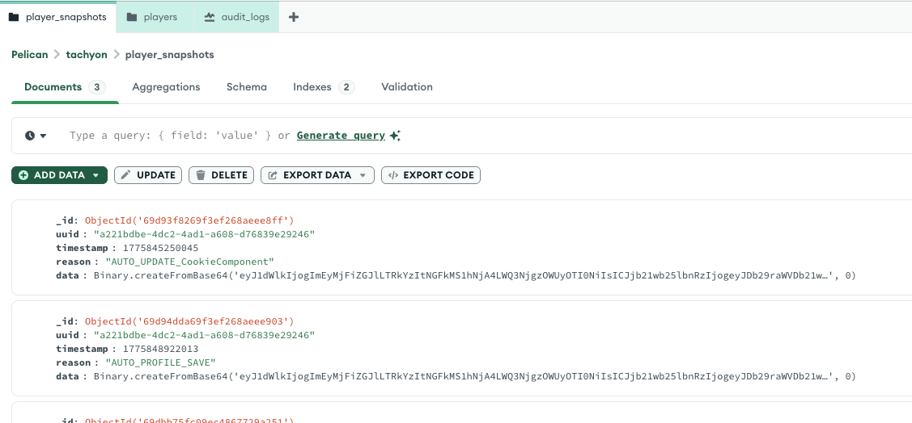
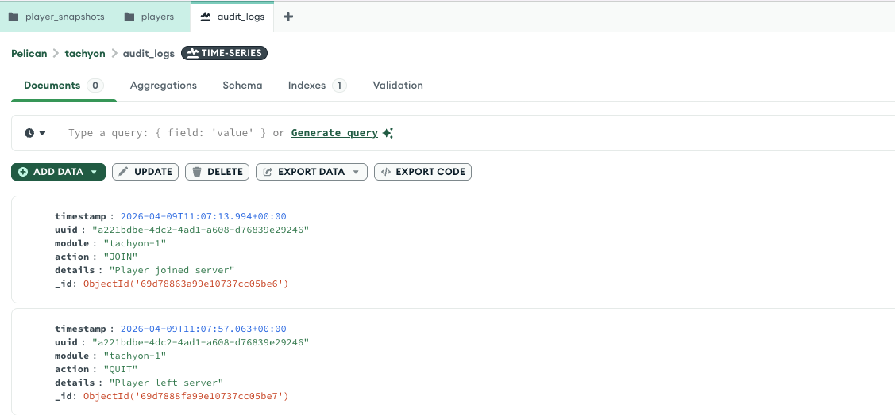
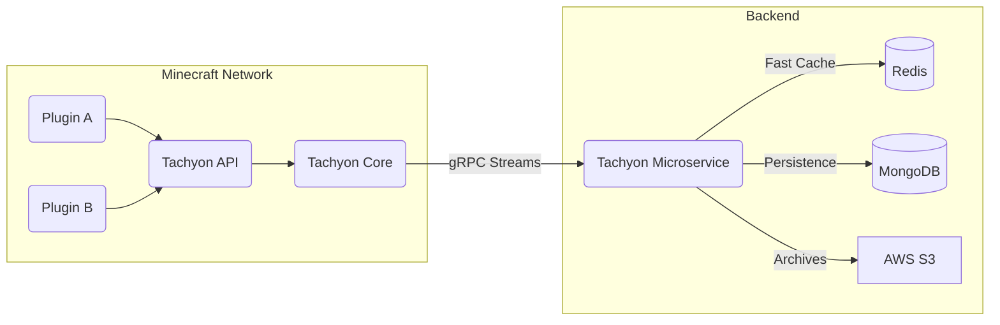
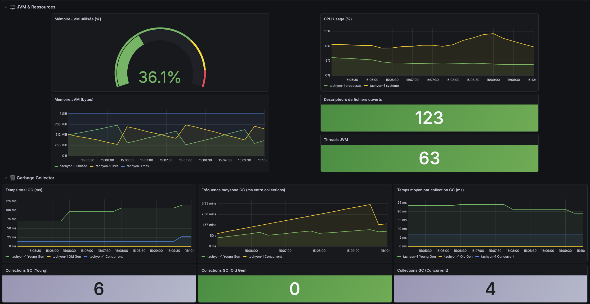
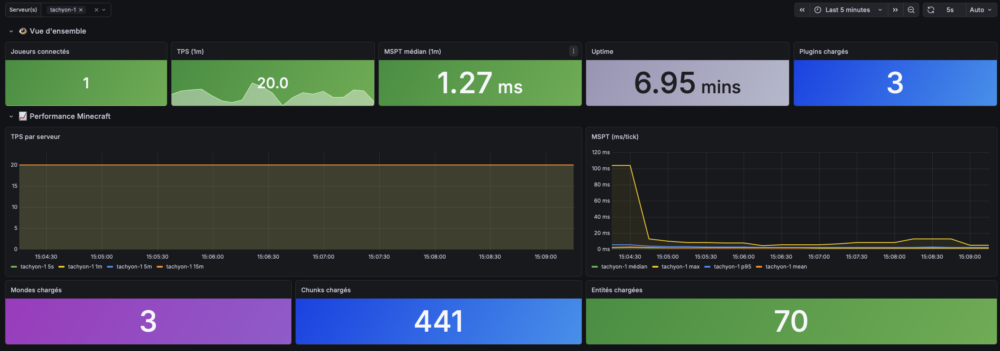

# Tachyon

Tachyon is an advanced, high-performance, and scalable player data management framework designed for modern Minecraft networks. It abstracts away the complexities of dealing with distributed player data across multiple servers by leveraging a microservice architecture with gRPC, Protocol Buffers (Protobuf), MongoDB, and AWS S3-compatible storage.

Instead of writing repetitive SQL queries or dealing with race conditions when a player switches servers, Tachyon handles synchronization, caching, snapshots, and auditing automatically behind the scenes.


> 📊 **Built for Production:** Real-time monitoring of gRPC latency, profile caching, and network health.
> 


## 🚀 Features

* **Component-Based Data System**: Define your player data schemas using Protobuf...
    <details><summary><i>👀 See MongoDB Schema (Protobuf & Cookies)</i></summary>
    
    </details>
* **Real-time Server Sync**: Powered by gRPC streams, player data is synchronized instantly across your entire network. When a player switches servers, their data is ready before they even connect.
* **Snapshots & Backups**: Every data change can be versioned. Tachyon securely stores...
    <details><summary><i>👀 See MongoDB Snapshots (Binary Data)</i></summary>
    
    </details>
* **S3 Janitor**: Purges old or redundant snapshots and moves them to your S3 storage to save database space, reduce costs, and optimize resources.
* **Audit Logs**: A built-in system to track critical player actions...
    <details><summary><i>👀 See MongoDB Audit Logs</i></summary>
    
    </details>
* **Retry Queue & Resiliency**: Network failure? Database timeout? Tachyon queues pending operations and retries them automatically when the connection is restored.
* **Health & Metrics**: Built-in readiness and liveness checks, alongside a comprehensive metrics scraper for monitoring (e.g., Prometheus/Grafana integration).

## ⚖️ Benefits Compared to Vanilla

When building a Minecraft network, managing player data (economy, stats, inventory) is often the hardest part. Here is why you should use Tachyon over a traditional "Vanilla" approach (managing your own MySQL/MongoDB connections):

| Feature | Vanilla Approach | Tachyon |
|---------|-----------------|---------|
| **Data Schema** | Manual SQL tables or raw JSON objects. Hard to refactor. | **Type-Safe** Protobuf schemas. Easy to evolve without breaking old data. |
| **Server Sync** | Manual Redis pub/sub or database polling. Prone to race conditions (dupe glitches). | **Automated** gRPC streams. Handles lock acquisition and state transfers seamlessly. |
| **Backups** | Full daily database dumps. Restoring one player's data is a nightmare. | **Granular Snapshots**. Rollback a single player's specific component to a specific point in time. |
| **Extensibility** | Every plugin manages its own database connection and tables. | **Centralized Component Registry**. Plugins just register their Protobuf message and Tachyon handles the rest. |
| **Auditing** | Writing custom text files or bloated SQL logs. | Built-in, structured **Audit gRPC Service**. |

## 🛠️ Developers: How to Use the API

Tachyon is designed to be extremely developer-friendly. You don't need to write any database code.

### 1. Define your Component (Protobuf)
Create a `.proto` file in your plugin to define your data structure.
```protobuf
syntax = "proto3";
package tech.skworks.cookies.components;

option java_multiple_files = true;
option java_package = "tech.skworks.cookies.components";

message CookieComponent {
  int64 cookies = 1;
}
```

### 2. Extend `TachyonPlugin`
Make your main plugin class extend `TachyonPlugin` instead of `JavaPlugin`. Be sure to add `Tachyon-Core` to your `plugin.yml` dependencies!

```java
public class TachyonCookies extends JavaPlugin {

    private TachyonAPI tachyon;

    @Override
    public void onEnable() {
        if (!setupTachyon()) {
            getLogger().severe("TachyonApi missing ! Disabling...");
            getServer().getPluginManager().disablePlugin(this);
            return;
        }
        tachyon.registerComponent(CookieComponent.getDefaultInstance());
        getCommand("cookie").setExecutor(new CookieCommand(this));
        getLogger().info("Cookie Clicker loaded !");
    }

    private boolean setupTachyon() {
        RegisteredServiceProvider<TachyonAPI> rsp = getServer().getServicesManager().getRegistration(TachyonAPI.class);
        if (rsp == null) return false;

        tachyon = rsp.getProvider();
        return tachyon != null;
    }

    public TachyonAPI getTachyon() {
        return tachyon;
    }
}
```

### 3. Access and Modify Player Data
You can retrieve a player's profile and read/write their components with ease.

```java
public class CookieCommand implements CommandExecutor {

    private final TachyonCookies plugin;

    public CookieCommand(TachyonCookies plugin) {
        this.plugin = plugin;
    }

    @Override
    public boolean onCommand(CommandSender sender, Command command, String label, String[] args) {
        if (!(sender instanceof Player player)) {
            sender.sendMessage("Only players can execute this command.");
            return true;
        }

        TachyonProfile profile = plugin.getTachyon().getProfile(player.getUniqueId());
        if (profile == null) {
            player.sendMessage("§cError: Your profile is not loaded from Tachyon yet.");
            return true;
        }

        // Get the cookie component. If the profile doesn't have it, provide a default value
        CookieComponent component = profile.getComponent(CookieComponent.class, CookieComponent.newBuilder().setCookies(0).build());

        if (args.length == 1 && args[0].equalsIgnoreCase("click")) {
            long newCookiesAmount = component.getCookies() + 1;

            //Update the component
            profile.updateComponent(CookieComponent.class, (CookieComponent.Builder builder) -> {
                builder.setCookies(newCookiesAmount);
            });

            player.sendMessage("§6+1 Cookie ! §e(Total : " + newCookiesAmount + ")");
            return true;
        }

        player.sendMessage("§7Use §f/cookie click §7to gain more cookies.");
        return true;
    }
}
```

## 🏗️ Architecture overview

Tachyon is split into multiple parts:
* **tachyon-service**: The standalone backend microservice (Java) that handles the gRPC server, database connections, and S3 communication.
* **tachyon-plugin**: The Minecraft plugin (API & Implementation) that servers run to connect to the backend service.
* **exemple-plugin**: A sample implementation showing how external plugins can hook into the API.



## 📈 Observability & Grafana Integration

Tachyon is built with transparency in mind. It natively exports deep metrics to Prometheus, allowing you to monitor your entire network's health from a centralized Grafana instance.

<details>
  <summary><b>🛠️ JVM & Resources Dashboard</b> (Click to expand)</summary>
  Monitor CPU, RAM, Garbage Collection cycles, and open file descriptors to catch memory leaks before they crash your server.
  <br><br>
  
</details>

<details>
  <summary><b>🎮 Minecraft Performance Dashboard</b> (Click to expand)</summary>
  Keep an eye on the actual game performance (TPS, MSPT, Chunks, Entities) alongside your data syncing.
  <br><br>
  
</details>
