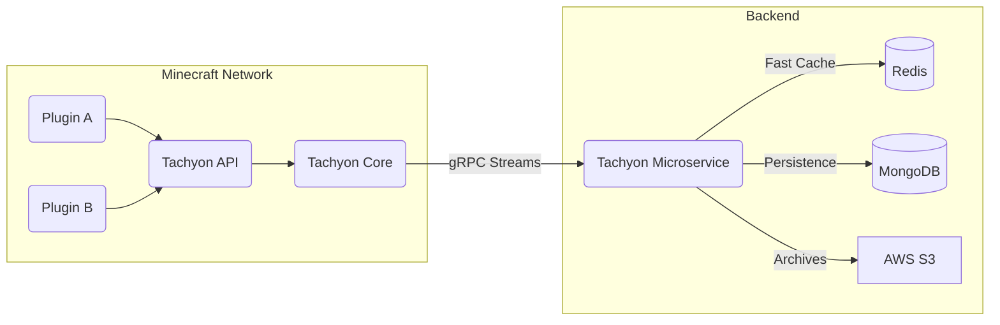

<div align="center">

# 🌌 Tachyon

**Advanced, High-Performance Player Data Management for Modern Minecraft Networks**

[](https://openjdk.org/)
[](https://papermc.io/)
[](https://www.mongodb.com/)
[](https://grpc.io/)
[](LICENSE)

</div>

<br>

Tachyon abstracts away the complexities of dealing with distributed player data across multiple servers. By leveraging a microservice architecture with **gRPC, Protocol Buffers (Protobuf), Redis, MongoDB, and AWS S3-compatible storage**, Tachyon guarantees zero-data-loss synchronization.

Instead of writing repetitive SQL queries or dealing with race conditions when a player switches servers, Tachyon handles synchronization, caching, snapshots, and auditing automatically behind the scenes.

> 📊 **Built for Production:** Enjoy real-time monitoring of gRPC latency, profile caching, and network health directly through our native Prometheus/Grafana integration.

---

## ⚖️ Why Tachyon? (Vanilla vs. Tachyon)

When building a Minecraft network, managing player data (economy, stats, inventory) is often the hardest part. Here is why you should upgrade to Tachyon:

| Feature | Vanilla Approach (MySQL/Mongo) | 🌌 Tachyon Ecosystem |
|---------|-----------------|---------|
| **Data Schema** | Manual SQL tables or raw JSON objects. Hard to refactor. | **Type-Safe** Protobuf schemas. Easy to evolve without breaking old data. |
| **Server Sync** | Manual Redis pub/sub or database polling. Prone to race conditions (dupe glitches). | **Automated** gRPC streams. Handles lock acquisition and state transfers seamlessly. |
| **Backups** | Full daily database dumps. Restoring one player's data is a nightmare. | **Granular Snapshots**. Rollback a single player's specific component to an exact point in time. |
| **Extensibility** | Every plugin manages its own database connection and tables. | **Centralized Component Registry**. Plugins just register their Protobuf message and Tachyon handles the rest. |
| **Auditing** | Writing custom text files or bloated SQL logs. | Built-in, structured **Audit gRPC Service**. |

---

## ✨ Core Features

* **📦 Component-Based Data System**: Define your player data schemas using Protobuf.
  <details><summary><i>👀 Click to see MongoDB Schema (Protobuf & Cookies)</i></summary>
  
  </details>

* **⚡ Real-time Server Sync**: Powered by gRPC streams, player data is synchronized instantly across your entire network. When a player switches servers, their data is ready before they even connect.

* **⏪ Snapshots & Backups**: Every data change can be versioned. Securely store and review point-in-time player data.
  <details><summary><i>👀 Click to see MongoDB Snapshots (Binary Data)</i></summary>
  
  </details>

* **🧹 S3 Janitor**: Purges old or redundant snapshots and moves them to your S3 storage to save database space, reduce costs, and optimize resources.

* **🕵️ Audit Logs**: A built-in system to track critical player actions for easy moderation and analytics.
  <details><summary><i>👀 Click to see MongoDB Audit Logs</i></summary>
  
  </details>

* **🛡️ Retry Queue & Resiliency**: Network failure? Database timeout? Tachyon queues pending operations and retries them automatically when the connection is restored.

---

## 🏗️ Architecture Overview

Tachyon relies on a strict separation of concerns, ensuring your Minecraft servers are never weighed down by heavy database computations.

* `tachyon-service`: The standalone backend microservice (Quarkus/Java) handling gRPC, DB connections, and S3.
* `tachyon-api`: The lightweight client API.
* `tachyon-minecraft-plugin`: The Spigot/Paper implementation to connect your servers to the backend.



---

## 🚀 Quick Start & Installation

### Prerequisites
* **Java 25+** (for both the Minecraft server and the microservice)
* **MongoDB 8.x** (Replica Set recommended for transactions)
* **Redis 8.x** (For Streams and Snapshot Queues)
* **Spigot / Paper 1.8.8+**

### Deployment Steps
1. **Start the Backend:** Deploy the `tachyon-service` alongside your MongoDB and Redis instances (Docker Compose is highly recommended).
2. **Install the Plugin:** Drop the `tachyon-minecraft-plugin.jar` into your Minecraft server's `plugins/` folder.
3. **Configure:** Start the server once to generate the config files, then edit `plugins/Tachyon/config.yml` to point to your gRPC backend host and port.
4. **Restart:** You're ready to go!

---

## 🛠️ Developers: How to Use the API

📚 **[Read the Official JavaDoc Here](https://vskah.github.io/Tachyon/)**

Tachyon is designed to be extremely developer-friendly. You don't need to write a single SQL query or manage database connections.

### 1. Define your Component (Protobuf)
Create a `.proto` file in your plugin to define your exact data structure.

```protobuf
syntax = "proto3";
package tech.skworks.tachyon.exampleplugin.components;

option java_multiple_files = true;
option java_package = "tech.skworks.tachyon.exampleplugin.components";

message CookieComponent {
  int64 cookies = 1;
}
```

### 2. Register the Component in your Plugin
Get the instance of `TachyonAPI<ItemStack>` through the Bukkit Services Manager and register your UI handler.

```java
public class TachyonCookies extends JavaPlugin {

    // <ItemStack> defines the visual type used by the ComponentRegistry for the UI
    private TachyonAPI<ItemStack> tachyon;

    @Override
    public void onEnable() {
        if (!setupTachyon()) {
            getLogger().severe("Tachyon API missing! Disabling...");
            getServer().getPluginManager().disablePlugin(this);
            return;
        }

        // Register your component and define how it should be displayed in the Snapshot GUI
        tachyon.getComponentRegistry().registerComponent(CookieComponent.getDefaultInstance(), new ComponentPreviewHandler<>() {

            @Override
            public ItemStack buildComponentIcon() {
                return new ItemStack(Material.COOKIE);
            }

            @Override
            public <C extends Message> ItemStack[] buildComponentDataDisplay(C message) {
                CookieComponent cookieComponent = (CookieComponent) message;
                
                ItemStack itemStack = new ItemStack(Material.COOKIE);
                ItemMeta meta = itemStack.getItemMeta();
                meta.setDisplayName("§6Amount of Cookies: §e" + cookieComponent.getCookies());
                itemStack.setItemMeta(meta);

                return new ItemStack[]{itemStack};
            }
        });
        
        getCommand("cookie").setExecutor(new CookieCommand(this));
    }

    private boolean setupTachyon() {
        RegisteredServiceProvider<TachyonAPI> rsp = getServer().getServicesManager().getRegistration(TachyonAPI.class);
        if (rsp == null) return false;
        tachyon = rsp.getProvider();
        return tachyon != null;
    }

    public TachyonAPI<ItemStack> getTachyon() {
        return tachyon;
    }
}
```

### 3. Access and Modify Player Data
You can retrieve a player's profile and read/write their components with absolute thread-safety.

```java
public class CookieCommand implements CommandExecutor {

    private final TachyonAPI<ItemStack> tachyon;

    public CookieCommand(TachyonCookies plugin) {
        this.tachyon = plugin.getTachyon();
    }

    @Override
    public boolean onCommand(CommandSender sender, Command command, String label, String[] args) {
        if (!(sender instanceof Player player)) return true;

        final UUID playerId = player.getUniqueId();
        final TachyonProfile profile = tachyon.getProfile(playerId);
        
        if (profile == null) {
            player.sendMessage("§cError: Your profile is not loaded from Tachyon yet.");
            return true;
        }

        // Get the component. If the player doesn't have it, provide a default value (0 cookies)
        CookieComponent component = profile.getComponent(CookieComponent.class, CookieComponent.newBuilder().setCookies(0).build());

        if (args.length == 1 && args[0].equalsIgnoreCase("click")) {
            long newCookiesAmount = component.getCookies() + 1;

            // Update the component in memory and automatically mark it as dirty for the backend
            profile.updateComponent(CookieComponent.class, (CookieComponent.Builder builder) -> builder.setCookies(newCookiesAmount));

            // Log the action to the backend Audit Service
            tachyon.getAuditService().log(playerId.toString(), "GAIN_COOKIES", "+1");
            player.sendMessage("§6+1 Cookie! §e(Total: " + newCookiesAmount + ")");
            return true;
        }

        player.sendMessage("§7Use §f/cookie click §7to gain more cookies.");
        return true;
    }
}
```

---

## 📈 Observability & Grafana Integration

Tachyon is built with transparency in mind. It natively exports deep metrics to Prometheus, allowing you to monitor your entire network's health from a centralized Grafana instance.

<details>
  <summary><b>🛠️ JVM & Resources Dashboard</b> (Click to expand)</summary>
  <p>Monitor CPU, RAM, Garbage Collection cycles, and open file descriptors to catch memory leaks before they crash your server.</p>
  
</details>

<details>
  <summary><b>🎮 Minecraft Performance Dashboard</b> (Click to expand)</summary>
  <p>Keep an eye on the actual game performance (TPS, MSPT, Chunks, Entities) alongside your data syncing.</p>
  
  
</details>