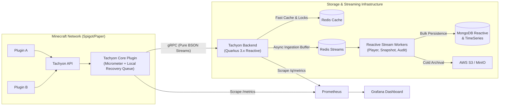

<div align="center">

# 🌌 Tachyon

**High-Performance, Reactive Distributed Player Data Management for Modern Minecraft Networks**

[](https://openjdk.org/)
[](https://papermc.io/)
[](https://quarkus.io/)
[](https://www.mongodb.com/)
[](https://redis.io/)
[](https://grpc.io/)
[](https://micrometer.io/)
[](LICENSE)

</div>

<br>

**Tachyon** abstracts away the complexities of dealing with distributed player data across multi-server Minecraft networks. Built from the ground up with **Java 25, gRPC (Pure BSON zero-copy), Redis Streams, MongoDB Reactive & TimeSeries, and AWS S3-compatible cold storage**, Tachyon guarantees blazing-fast, race-condition-free synchronization with zero data loss.

Instead of writing repetitive SQL queries or battling dupe glitches when players rapidly hop between servers, Tachyon handles distributed locking, state transfers, streaming persistence, granular rollbacks, and audit logging seamlessly.

> 📊 **Turnkey Observability:** Full real-time visibility into gRPC latency (P50/P95/P99), lock contention retries, JVM memory pools, thread states, and server TPS/MSPT directly in our pre-configured [Grafana Dashboard](grafana/minecraft-monitoring.json).

---

## ⚖️ Why Tachyon? (Legacy SQL/JSON vs. Tachyon 2.0)

| Feature | Legacy Approach (MySQL/Mongo Sync) | 🌌 Tachyon 2.0 Ecosystem |
| :--- | :--- | :--- |
| **Data Format** | Heavy JSON blobs or rigid SQL tables. Schema refactoring is painful. | **Pure BSON & Java Records**. Zero-copy binary serialization with type-safe codecs. |
| **Server Sync & Locks** | Manual pub/sub or polling. Prone to race conditions and inventory duplication. | **Automated Distributed Leases & Heartbeats**. Cross-server atomic state control with lock telemetry. |
| **Persistence I/O** | Synchronous DB queries blocking the server thread on join/quit. | **Asynchronous Redis Streams Buffer**. Writes are enqueued in microseconds and flushed non-blockingly to MongoDB. |
| **Backups & Rollbacks** | Massive full-database dumps. Restoring one player's lost item is tedious. | **Granular Point-in-Time Snapshots**. Roll back a single component or entire profile with a GUI. |
| **Cold Storage** | Databases bloat over time with inactive snapshots. | **Automated S3 Janitor**. Compresses and archives historical snapshots to S3-compatible object storage. |
| **Resilience & Failover** | Network hiccup = lost player progress. | **Local Dead-Letter Recovery Queue**. Automatically persists pending saves to disk and retries upon reconnection. |
| **Observability** | Custom log parsers or basic TPS commands. | **Native Micrometer Engine**. Deep Grafana dashboards tracking gRPC percentiles, JVM internals, and Spark TPS/MSPT. |

---

## ✨ Core Features

* **📦 Pure BSON Component Engine**: Define your player data schemas using standard Java 25 records and `ComponentCodec<T>` with zero boilerplate.
* **⚡ 100% Non-Blocking Reactive Pipeline**: Built on Quarkus, SmallRye Mutiny, and Netty. The backend never blocks threads, handling tens of thousands of requests per second with minimal RAM.
* **🔒 Distributed State & Lock Protection**: Prevents multi-server login dupes with distributed lease tokens, non-blocking heartbeats, and lock contention telemetry.
* **⏪ Granular Snapshots & S3 Archival**: Point-in-time player backups with GUI inspection. Older snapshots are automatically moved to S3 cold storage.
* **🕵️ TimeSeries Auditing**: Track critical player transactions, balance updates, and administrative actions in MongoDB TimeSeries collections with automatic TTL expiration.
* **🛡️ Local Recovery Queue**: If the backend goes down or network connectivity drops, the Spigot plugin writes pending saves to a local binary recovery store and flushes them when the connection is restored.
* **📈 Out-of-the-Box Micrometer & Grafana Dashboard**: Exposes Prometheus metrics covering gRPC network health, profile load duration, GC pauses, memory pools, and thread states.

---

## 🏗️ Architecture Overview


```mermaid
graph LR
    subgraph "Minecraft Network (Spigot/Paper)"
        P1["Plugin A"] --> API["Tachyon API"]
        P2["Plugin B"] --> API
        API --> Core["Tachyon Core Plugin\n(Micrometer + Local Recovery Queue)"]
    end

    Core -- "gRPC (Pure BSON Streams)" --> Service["Tachyon Backend\n(Quarkus 3.x Reactive)"]

    subgraph "Storage & Streaming Infrastructure"
        Service -- "Fast Cache & Locks" --> RedisCache[("Redis Cache")]
        Service -- "Async Ingestion Buffer" --> RedisStreams[("Redis Streams")]
        RedisStreams --> Workers["Reactive Stream Workers\n(Player, Snapshot, Audit)"]
        Workers -- "Bulk Persistence" --> Mongo[("MongoDB Reactive\n& TimeSeries")]
        Workers -- "Cold Archival" --> S3["AWS S3 / MinIO"]
    end

    Core -- "Scrape /metrics" --> Prometheus["Prometheus"]
    Service -- "Scrape /q/metrics" --> Prometheus
    Prometheus --> Grafana["Grafana Dashboard"]
```

---

## 🚀 Quick Start & Installation

### Prerequisites
* **Java 25+** (for both the Minecraft server and `tachyon-service`)
* **MongoDB 8.x** (Replica Set recommended)
* **Redis 7.x / 8.x** (for Streams, state locks, and distributed caching)
* **Spigot / Paper 1.8.8+** (or modern Paper/Purpur)
* **Prometheus & Grafana** (optional, for real-time monitoring)

### Deployment Steps
1. **Start the Backend Microservice:**
   Deploy `tachyon-service` alongside MongoDB and Redis (Docker Compose recommended).
   ```bash
   # Build the Quarkus runner jar
   mvn clean package -pl tachyon-service -DskipTests
   java -jar tachyon-service/target/quarkus-app/quarkus-run.jar
   ```
2. **Install the Spigot Plugin:**
   Copy `tachyon-minecraft-plugin.jar` into your Minecraft server's `plugins/` folder.
3. **Configure Connection:**
   Start the server to generate `plugins/Tachyon/config.yml` and set your gRPC host, port, and security parameters:
   ```yaml
   backend:
     host: "127.0.0.1"
     port: 9090
     use-tls: false
   metrics:
     enabled: true
     port: 9100
   ```
4. **Import the Grafana Dashboard:**
   Import [`grafana/minecraft-monitoring.json`](grafana/minecraft-monitoring.json) into your Grafana instance to monitor real-time network and JVM telemetry.

---

## 🛠️ Developers: How to Use the API

Tachyon is designed to be developer-friendly, type-safe, and non-intrusive.

### 1. Define your Component (Java Record + BSON Codec)

Create an immutable record representing your data, along with a `ComponentCodec` defining its BSON serialization and UI representation:

```java
package tech.skworks.tachyon.exampleplugin.component;

import lombok.Builder;
import org.bson.BsonDocument;
import org.bson.BsonInt64;
import org.bukkit.Material;
import org.bukkit.inventory.ItemStack;
import org.bukkit.inventory.meta.ItemMeta;
import tech.skworks.tachyon.api.component.ComponentCodec;
import tech.skworks.tachyon.api.component.ComponentNamespace;
import tech.skworks.tachyon.api.component.ComponentPreviewHandler;

@Builder(toBuilder = true)
public record CookieComponent(long cookiesAmount) {

    private static final String NAMESPACE_GROUP = "TachyonCookies";
    private static final String NAMESPACE_KEY = "cookies";
    private static final long DEFAULT_COOKIE_AMOUNT = 0L;

    public CookieComponent {
        if (cookiesAmount < 0) {
            throw new IllegalArgumentException("cookiesAmount cannot be negative: %d".formatted(cookiesAmount));
        }
    }

    public static class CookieComponentCodec implements ComponentCodec<CookieComponent>, ComponentPreviewHandler<ItemStack, CookieComponent> {

        private static final ComponentNamespace NAMESPACE = ComponentNamespace.of(NAMESPACE_GROUP, NAMESPACE_KEY);
        private static final String BSON_FIELD_COOKIES = "cookies";

        @Override
        public ComponentNamespace getComponentNamespace() {
            return NAMESPACE;
        }

        @Override
        public Class<CookieComponent> getComponentClass() {
            return CookieComponent.class;
        }

        @Override
        public BsonDocument encode(CookieComponent component) {
            return new BsonDocument(BSON_FIELD_COOKIES, new BsonInt64(component.cookiesAmount()));
        }

        @Override
        public CookieComponent decode(BsonDocument bson) {
            long value = bson.getNumber(BSON_FIELD_COOKIES, new BsonInt64(DEFAULT_COOKIE_AMOUNT)).longValue();
            return new CookieComponent(value);
        }

        @Override
        public ItemStack buildComponentIcon() {
            return new ItemStack(Material.COOKIE);
        }

        @Override
        public ItemStack[] buildComponentDataDisplay(CookieComponent record) {
            ItemStack itemStack = new ItemStack(Material.COOKIE);
            ItemMeta meta = itemStack.getItemMeta();
            meta.setDisplayName("§6Cookies: §e" + record.cookiesAmount());
            itemStack.setItemMeta(meta);
            return new ItemStack[]{itemStack};
        }
    }
}
```

### 2. Register the Codec in your Plugin

Obtain `TachyonAPI` from Bukkit's Service Manager and register your codec:

```java
public class TachyonCookies extends JavaPlugin {

    private TachyonAPI tachyon;

    @Override
    public void onEnable() {
        RegisteredServiceProvider<TachyonAPI> rsp = getServer().getServicesManager().getRegistration(TachyonAPI.class);
        if (rsp == null) {
            getLogger().severe("TachyonAPI not found! Disabling...");
            getServer().getPluginManager().disablePlugin(this);
            return;
        }
        this.tachyon = rsp.getProvider();

        var cookieCodec = new CookieComponent.CookieComponentCodec();
        tachyon.getComponentRegistry().registerCodec(cookieCodec);
        tachyon.getComponentRegistry().registerPreviewHandler(CookieComponent.class, cookieCodec);

        getCommand("cookie").setExecutor(new CookieCommand(this));
    }

    public TachyonAPI getTachyon() {
        return tachyon;
    }
}
```

### 3. Read and Mutate Player Data

Access player profiles with thread safety, perform atomic in-memory mutations, and submit structured audit logs:

```java
public class CookieCommand implements CommandExecutor {

    private final TachyonCookies plugin;

    public CookieCommand(TachyonCookies plugin) {
        this.plugin = plugin;
    }

    @Override
    public boolean onCommand(CommandSender sender, Command command, String label, String[] args) {
        if (!(sender instanceof Player player)) return true;

        final UUID playerId = player.getUniqueId();
        final TachyonProfile profile = plugin.getTachyon().getTachyonProfileRegistry().getProfile(playerId);

        if (profile == null) {
            player.sendMessage("§cYour profile is still loading from Tachyon...");
            return true;
        }

        // Retrieve component (or fallback to default if not present)
        CookieComponent component = profile.getComponent(CookieComponent.class, new CookieComponent(0));

        if (args.length == 1 && args[0].equalsIgnoreCase("click")) {
            long newAmount = component.cookiesAmount() + 1;

            // Mutate component & mark dirty for async stream flushing
            profile.updateComponent(CookieComponent.class, current -> current.toBuilder().cookiesAmount(newAmount).build());

            // Log structured action to MongoDB TimeSeries Audit
            plugin.getTachyon().getAuditService().log(AuditEntry.of(playerId, "COOKIE_MODULE", "GAIN_COOKIES", "+1"));

            player.sendMessage("§6+1 Cookie! §e(Total: " + newAmount + ")");
            return true;
        }

        player.sendMessage("§7Use §f/cookie click §7to collect cookies.");
        return true;
    }
}
```

---

## 📊 Turnkey Observability (Micrometer & Grafana)

Tachyon embeds a native Micrometer metrics engine on port `9100` (configurable in `config.yml`).

The provided dashboard [`grafana/minecraft-monitoring.json`](grafana/minecraft-monitoring.json) includes:

* **⚡ gRPC & Network Health**: Real-time gRPC pure latency percentiles (P50, P95, P99), profile load duration, and error rates.
* **🔒 Lock Contention & Safety**: Lock retry counters (`tachyon_plugin_player_locked_retries_total`) and exhausted lock kick alerts.
* **🛡️ Resiliency & Storage**: Retry queue task count, local recovery file buffer size, and active cached profile counts.
* **☕ JVM Internals**: Heap usage vs. commit limits, stacked memory pools (Eden, Old, Survivor, Metaspace), GC pause frequency and durations, thread states (RUNNABLE / BLOCKED / WAITING), and OS open file descriptors.
* **🎮 Minecraft Performance**: Real-time TPS (1m/5m/15m), MSPT (P50/P95/P99), loaded chunks, and entity counts via Spark integration.

---

## 📄 License

This project is licensed under the **GNU General Public License v3.0 (GPLv3)**. See the [LICENSE](LICENSE) file for details.
